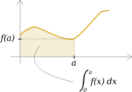

.. Projet HPC documentation master file, created by
   sphinx-quickstart on Thu Mar 28 09:29:30 2019.
   You can adapt this file completely to your liking, but it should at least
   contain the root `toctree` directive.

Welcome to Projet HPC's documentation!
======================================

Bienvenue sur la documentation de notre projet ! Ici vous saurez comment utiliser notre code pour calculer des intégrales de fonctions simplement grâce à Python !
Enjoy ! :)

.. toctree::
   :maxdepth: 2

   rect
   trap

Indices and tables
==================

* :ref:`genindex`
* :ref:`search`
